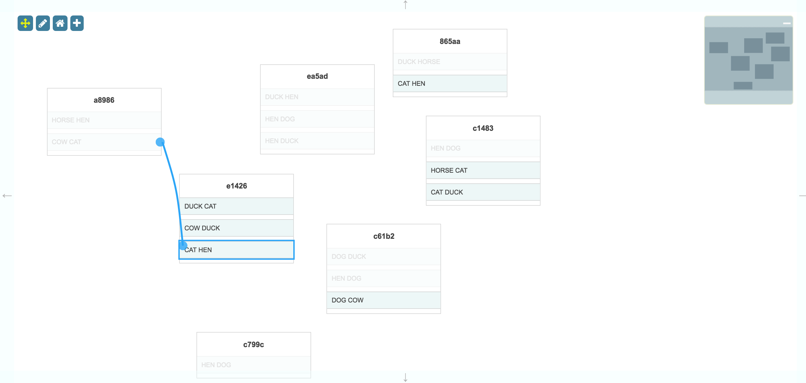

<a name="top"></a>
## Active Filtering

This is a demonstration of the **activeFiltering** option in the Surface widget.



<a name="package"></a>
### package.json

```javascript
{
    "dependencies": {
        "font-awesome": "^4.7.0",
        "jsplumbtoolkit": "file:./jsplumbtoolkit.tgz"
    }
}

```

[TOP](#top)

---

<a name="setup"></a>
### Page Setup

#### CSS

- **jsplumbtoolkit.css**     Contains sane defaults for various core Toolkit widgets. Recommended for inclusion, as least until you can override everything you need to. 
- **jsplumbtoolkit-demo-support.css**      Common styles for the Toolkit demo pages. Not needed for your apps.
- **app.css**  Styles for this demonstration.

#### JS

- **jsplumbtoolkit.js**          Core jsPlumb Toolkit code.
- **app.js** Application specific JS.

With the exception of `app.css` and `app.js` each of these is loaded from a package with the same name.

[TOP](#top)

---

<a name="templates"></a>
### Templates

This demonstration uses a single template to render its nodes:

```xml
<script type="jtk" id="tmplNode">
    <div class="connectivity-node">
        <h3>${id.substring(0, 5)}</h3>
        <ul>
            <r-each in="items">
                <li>
                    <span>${entries.join(' ')}</span>
                    <jtk-source port-id="${index}"/>
                    <jtk-target port-id="${index}"/>
                </li>
            </r-each>
        </ul>
    </div>
</script>
```

[TOP](#top)

---

<a name="toolkit"></a>
### Creating the Toolkit instance

The Toolkit instance is created like this:


```javascript
var toolkit = jsPlumbToolkit.newInstance({
    beforeConnect:function(source, target) {
        
         -- see 'Active Filtering' section below --
    }
});

```


[TOP](#top)

---


<a name="loading"></a>
### Data Loading

Nodes for this demonstration consist of a list of Ports, each of which has the name of two animals randomly selected from a list.  The code to generate Nodes is as follows (but note that this code is demo-specific; it exists purely for this demo):


```javascript

var words = [
    "CAT", "DOG", "COW", "HORSE", "DUCK", "HEN"
];

var randomPort = function(index) {
    var out = [], map = {};
    function _one() {
        var a, done = false;
        while (!done) {
            a = words[Math.floor(Math.random() * words.length)];
            done = map[a] !== true;
            map[a] = true;
        }
        return a;
    }
    out.push(_one());
    out.push(_one());
    return { entries:out, index:index };
};

var newNode = function() {
    var groupCount = Math.floor(Math.random() * 3) + 1,
        data = {
            id:jsPlumbUtil.uuid(),
            items:[]
        };

    for (var i = 0; i < groupCount; i++) {
        data.items.push(randomPort(i));
    }

    toolkit.addNode(data);
};
```

The initial dataset is constructed as follows:

```javascript
var nodeCount = 5;
for (var i = 0; i < nodeCount;i++) {
    newNode();
}

```

Subsequently, when the user presses the `+` button, a new Node is added using the `newNode` method, which adds a new node to a random place on the screen.

[TOP](#top)

---

<a name="view"></a>
### View

```javascript
var view = {
    nodes: {
        "default": {
            template: "tmplNode"
        }
    },
    edges: {
        "default": {
            connector: [ "StateMachine", { curviness: 10 } ],
            endpoint: [ "Dot", { radius: 10 } ],
            anchor: [ "Continuous", { faces:[ "left", "right" ]} ]
        }
    }
};
```

There is a single Node type ("default") defined, mapped to the template shown above, and a single Edge, which contains rendering instructions for the Connector, its Endpoints, and the type of Anchor to use.

[TOP](#top)

---

<a name="rendering"></a>
### Rendering

This is the call that sets up the UI:

```javascript
var renderer = toolkit.render({
    container: canvasElement,
    zoomToFit: true,
    view: view,
    layout: {
        type: "Spring"
    },
    miniview: {
        container:miniviewElement
    },
    lassoFilter: ".controls, .controls *, .miniview, .miniview *",
    events: {
        canvasClick: function (e) {
            toolkit.clearSelection();
        },
        modeChanged: function (mode) {
            jsPlumb.removeClass(jsPlumb.getSelector("[mode]"), "selected-mode");
            jsPlumb.addClass(jsPlumb.getSelector("[mode='" + mode + "']"), "selected-mode");
        }
    },
    consumeRightClick:false,
    activeFiltering:true
});
```

Here's an explanation of what the various parameters mean:

- **container**

This identifies the element into which you wish the Toolkit to render.

- **view**

These are the Node and Edge definitions for this renderer, discussed above.

- **layout**

Parameters for the layout. 

```javascript
{
  type:"Spring"
}
```


We specify a `Spring` layout (force directed).

- **miniview**

```javascript
{
  container:miniviewElement
}
```

The miniview options provide the the element to convert into a Miniview. You can also provide an element ID here.

- **lassoFilter**

This selector specifies elements on which a mousedown should not cause the selection lasso to begin. In this demonstration we exclude the buttons in the top left and the Miniview.

- **events**

We listen for two events:

  `canvasClick` - a click somewhere on the widget's whitespace. Then we clear the Toolkit's current selection.
  
  `modeChanged` - Surface's mode has changed (either "select" or "pan"). We update the state of the buttons.

- **zoomToFit**

Instructs the Surface to zoom the contents of the display when it is first rendered so that every Node is visible.

- **activeFiltering**

This flag is the key to this demonstration - see below.

[TOP](#top)

---

<a name="filtering"></a>
### Active Filtering

The `activeFiltering:true` parameter set on the `render` call instructs the Surface to invoke the `beforeConnect` function declared on the Toolkit for every combination of Node/Port whenever the user starts to drag a new Edge. Whenever `beforeConnect` does not return true, the related target is disabled.

#### beforeConnect


```javascript
beforeConnect:function(source, target) {

    // ignore node->node connections; our UI is not configured to produce them. we could catch it and
    // return false, though, which would ensure that nodes could not be connected programmatically.

    if (source.objectType !== "Node" && target.objectType !== "Node") {

        // cannot create loopback connections
        if (source === target) {
            return false;
        }

        // cannot connect to Ports on the same Node as the Edge source
        if (source.getNode() === target.getNode()) {
            return false;
        }

        var sourceData = source.getNode().data,
            targetData = target.getNode().data;

        // attempt to match animals.
        var sourceItem  = sourceData.items[source.id];
        var targetItem  = targetData.items[target.id];
        if (sourceItem.entries && targetItem.entries) {
            for (var i = 0; i < sourceItem.entries.length; i++) {
                if (targetItem.entries.indexOf(sourceItem.entries[i]) !== -1) {
                    return true;
                }
            }
        }
        return false;
    }
}

```

#### CSS

In this demonstration, disabled targets are made more transparent and their text color is changed to light grey. This is achieved via a CSS class:

```css
.jtk-target-disabled {
    color:#999;
    opacity:0.3;
    outline:none;
}
```

`jtk-target-disabled` is set on a connection target by jsPlumb whenever the target is disabled.


[TOP](#top)

---

<a name="adding"></a>
### Adding New Nodes

The `+` button in the top left corner can be used to add a new Node. Here's the code that sets up the listener and adds the new Node:

```javascript
//
// assign a class to a new node which brings the user's attention to it. then a little while later,
// take it off.
//
function flash(el) {
    jsPlumb.addClass(el, "hl");
    setTimeout(function() {
        jsPlumb.removeClass(el, "hl");
    }, 1950);
}

jsPlumb.on(mainElement, "tap", "[add]", function() {
    var node = newNode();
    renderer.zoomToFit();
    flash(renderer.getRenderedElement(node));
});
```

We add the Node to the data model first via the `newNode` function we saw above. Then we instruct the Surface to resize so it fits all the content, and then we use `getRenderedElement(node)` on our Surface widget to retrieve the  DOM element that was rendered for the given Node.  We then use a little helper function to draw the user's attention to the new Node.

The CSS class is specified like this:

```css
.hl {
    outline:12px solid #ffc06c;
}
```


[TOP](#top)

---

<a name="selecting"></a>
### Selecting Nodes

Lasso selection is enabled by default on the Surface widget. To activate the lasso, click the pencil icon in the toolbar:


The code that listens to clicks on this icon is as follows:

```javascript
// pan mode/select mode
jsPlumb.on(".controls", "tap", "[mode]", function () {
  renderer.setMode(this.getAttribute("mode"));
});
```

The tap listener extracts the desired mode from the button that was clicked and sets it on the renderer. This causes a `modeChanged` event to be fired, which is picked up by the `modeChanged` event listener in the View.

Note that here we could have used a `click` listener, but `tap` works better for mobile devices.

##### Lasso Operation

The lasso works in two ways: when you drag from left to right, any node that intersects your lasso will be selected.  When you drag from right to left, only nodes that are enclosed by your lasso will be selected.

##### Exiting Select Mode

The Surface widget automatically exits select mode once the user has selected something. In this application we also listen to clicks on the whitespace in the widget and switch back to pan mode when we detect one. This is the `events` argument to the `render` call:

```javascript
events: {
  canvasClick: function (e) {
    toolkit.clearSelection();
  }
}
```

`clearSelection` clears the current selection and switches back to Pan mode.

[TOP](#top)
